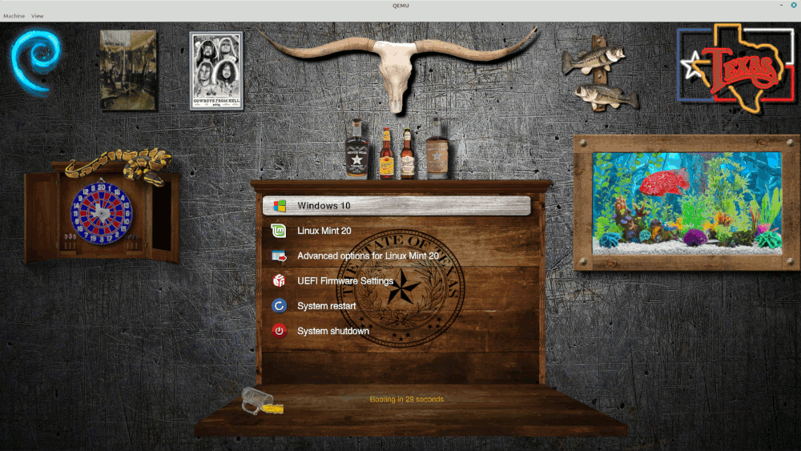

# The Grub Cave - Grub2 theme #
### Designed for 1920x1080 Resolution ###
### Created by @texxasrulez ###

### Latest Screenshot ###

  

Every image in this theme is a seperate entity and can be removed, changed or repositioned as you see fit in the theme.txt file.  

### Included Icons ###

| Operating System & Logo															| Operating System & Logo																| Operating System & Logo																	|
|:---																				|:---																					|:---																						|
| Alipine Linux 	| GhostBSD 				| RaspberryPi OS 		|
| Alt Linux 		| Guix 						| RedHat 						|
| Android 			| Haiku 					| Refind 						|
| Antergos 			| Hardware Test 			| RemixOS 					|
| Antix 				| Kali Linux   				| Rocky Linux  			|
| Apricity 			| Korora 					| Rosa 							|
| Arch Linux 			| Kubuntu 				| Sabayon 					|
| Arco Linux 		| Legacy 					| Siduction  				|
| Ataraxia Linux 	| Linux  					| Slackware 				|
| Boot CD 			| Linux Mint 			| Solus 						|
| CentOS 				| Lubuntu 				| Sparky 						|
| Chakra 				| Mac 						| Steam 				 		|
| Chrome 				| Mac Alt 				| Submenu Icon 				|
| Clear Linux 	| Mageia 					| Suse 							|
| Clover 				| Mandrivia 			| System Restart 			|
| Core 					| Manjaro 				| System Shutdown 			|
| Crunchbang 		| MXLinux 				| Tails Linux 					|
| Debian 				| Neon 						| Ubuntu 						|
| Deepin 				| Network 				| Ubuntu Gnome Alt 	|
| Edubuntu 			| OpenBSD 				| Ubuntu Gnome 			|
| Elementary 		| OpenMandrivia 	| Ubuntu Kylin 			|
| Endeavour OS 	| OpenSuse 				| Ubuntu Mate 			|
| Endless OS 		| Pardus Linux 		| UEFI 							|
| Eurolinux 		| PC-BSD 					| Unknown 					|
| Fatdog 				| PCLinuxOS 			| Windows 					|
| Fedora 				| PhoenixOS 			| Xubuntu 					|
| FreeBSD 			| Pisi Linux 				| Zorin 						|
| Frugalware 		| Pop OS 					|																							|
| Gentoo 				| Puppy Linux 				|																							|

**Installation**  
run `sudo bash install.sh`

This will copy files to /usr/share/grub/themes, backup current grub config then it will edit grub.cfg and execute  
update-grub / grub-mkconfig to make "The Grub Cave" your default Grub2 Bootloader Theme.  

Upon next reboot, The Grub Cave will be your boot screen.  

**USE at your OWN Risk!**  

:moneybag: **Donations** :moneybag:

If you use this theme and would like to show your appreciation by buying me a cup of coffee, I surely would appreciate it.  
A regular cup of Joe is sufficient, but a Starbucks Coffee would be better ...  
Zelle (Zelle is integrated within many major banks Mobile Apps by default) - Just send to texxasrulez at yahoo dot com  
No Zelle in your banks mobile app, no problem, just click [Paypal](https://paypal.me/texxasrulez?locale.x=en_US) and I can make a Starbucks run ...

I appreciate the interest in this theme and wish nothing but the best for all ...  
