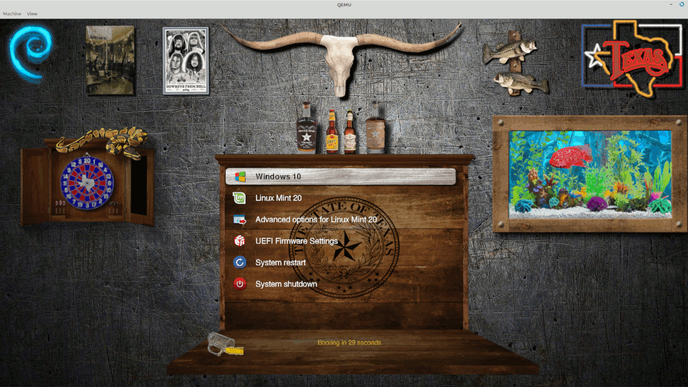

# The Grub Cave - Grub2 theme
### Designed for 1920x1080 Resolution
### Created by @texxasrulez

### Latest Screenshot

  

Every image in this theme is a seperate entity and can be removed, changed or repositioned as you see fit in the theme.txt file.  

**Installation**  
run `sudo bash install.sh`

This will copy files to /usr/share/grub/themes, backup current grub config then it will edit grub.cfg and execute  
update-grub / grub-mkconfig to make "The Grub Cave" your default Grub2 Bootloader Theme.  

Upon next reboot, The Grub Cave will be your boot screen.  

**USE at your OWN Risk!**  
